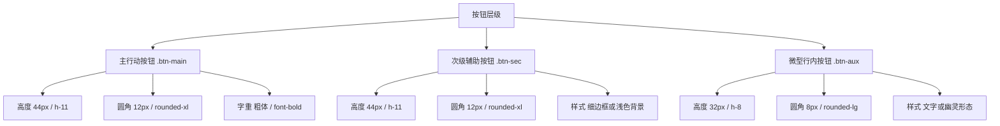

# 📖 全局 UI 设计与样式标准文档 (Global UI Design System)

本设计系统旨在为**健身训练辅助应用 (Training Assistant App)** 提供统一、高品质且符合现代设计美学的视觉及交互体验。所有新功能的开发和旧界面的重构都必须严格遵循本标准。

---

## 🎨 1. 颜色与调色板 (Colors & Theme)

系统支持日间模式 (Light) 和暗黑模式 (Dark)。颜色定义使用 CSS 变量，确保双模式切换顺滑无瑕。

### 🏷️ 品牌色与状态色
*   **主色 (Primary)**: `#FF6B35` (活力橙，用于核心按钮、高亮状态、关键交互)
*   **警示色 (Error/Alert)**: 日间 `#E53935` | 夜间 `#FF453A` (用于警示、错误、主项极限 T1 标识)
*   **成功色 (Success)**: 日间 `#2E7D32` | 夜间 `#32D74B` (用于保存成功、打卡完成等)
*   **T1 - T3 训练层级色**:
    *   **T1 (大重量极限)**: 日间 `#D94040` | 夜间 `#E05555`
    *   **T2 (容量组次极限)**: 日间 `#4A7FB5` | 夜间 `#6BA5D4`
    *   **T3 (辅助雕刻)**: 日间 `#8A6DB8` | 夜间 `#A68CC9`

### 🖥️ 基础背景与文字
*   **全局背景 (Base BG)**: 日间 `#F5F5F7` (纯净苹果灰) | 夜间 `#121212` (沉浸深黑)
*   **卡片背景 (Card BG)**: 日间 `#FFFFFF` (纯白) | 夜间 `#1E1E1E` (高亮黑)
*   **主文本 (Main Text)**: 日间 `#1C1C1E` | 夜间 `#FFFFFF`
*   **次要文本 (Secondary Text)**: 日间 `#6E6E73` | 夜间 `#98989D`
*   **卡片边框 (Card Border)**: 日间 `#E5E5EA` | 夜间 `#2C2C2E`

---

## 🅰️ 2. 排版与字号标准 (Typography)

全站主要字体使用 `Outfit` (西文/数字) + `Noto Sans SC` (中文)，呈现极致现代感。

| 排版类别 | CSS 类名 | 字号 (Desktop & Mobile) | 字重 (Font Weight) | 适用场景 |
| :--- | :--- | :--- | :--- | :--- |
| **页面大标题** | `.page-header` | `text-2xl` md: `text-3xl` (24px/30px) | `font-extrabold` (800) | 各主 Tab 页面顶部大标题（例如“今日”、“数据”） |
| **卡片标题** | `.card-title-standard` | `text-base` md: `text-lg` (16px/18px) | `font-bold` (700) | 卡片头部名称，自带底部虚线或细实线分割，留白均匀 |
| **区块小标题** | `.section-subtitle` | `text-xs` (12px) | `font-bold` (700) | 表单项 label、卡片内部分组的小字符标识 |
| **大正文** | `.body-large` | `text-base` md: `text-lg` (16px/18px) | `font-medium` (500) | 核心总结、大段引言或突出内容描述 |
| **标准正文** | `.body-normal` | `text-sm` md: `text-base` (14px/16px) | `font-normal` (400) | 普通段落文本、详细规则说明 |
| **信息正文** | `.body-medium` | `text-xs` md: `text-sm` (12px/14px) | `font-medium` (500) | 列表明细、高密度数据网格展示内容 |
| **辅助/备注** | `.body-muted` | `text-xs` md: `text-sm` (12px/13px) | `font-normal` (400) | 灰色补充文本、辅助说明文字 |
| **微型标注** | `.body-caption` | `text-[10px]` md: `text-xs` (10px/12px) | `font-normal` (400) | 底部声明、副版本号、细微状态与时间戳 |

---

## 🔘 3. 按钮标准 (Buttons)

按钮垂直高度是全局 UI 统一的重中之重。严禁随意手写高度或混用不同高度的按钮。



### 3.1 主行动按钮 (Primary Action) - `.btn-main`
*   **高度**: `44px` (`h-11` / `min-h-11`)
*   **圆角**: `12px` (`rounded-xl`)
*   **字号与字重**: `text-sm` (移动端可略缩，默认 text-sm 或 text-base)，`font-bold`
*   **样式**: 主色背景，带微阴影
*   **动效**: 悬浮微放大 (`hover:scale-[1.01]`)，按下微缩小 (`active:scale-[0.99]`)，过渡平滑 (`transition-all`)
*   **HTML 示例**:
    ```html
    <button class="btn-main">保存今日身体数据</button>
    ```

### 3.2 次要/取消按钮 (Secondary Action) - `.btn-sec`
*   **高度**: `44px` (`h-11` / `min-h-11`)
*   **圆角**: `12px` (`rounded-xl`)
*   **字号与字重**: `text-sm font-semibold`
*   **样式**: 边框型 (`border border-border-card`) 或幽灵型 (`btn-ghost`)
*   **HTML 示例**:
    ```html
    <button class="btn-sec">取消修改</button>
    ```

### 3.3 辅助小按钮 (Auxiliary Action) - `.btn-aux`
*   **高度**: `32px` (`h-8` / `min-h-8`)
*   **圆角**: `8px` (`rounded-lg`)
*   **字号与字重**: `text-xs font-medium`
*   **样式**: 极简幽灵按钮、行内徽章按钮或小型圆圈按钮
*   **HTML 示例**:
    ```html
    <button class="btn-aux">查看详情</button>
    ```

---

## 📝 4. 表单与控件标准 (Forms & Controls)

表单输入框和下拉选择器必须与按钮高度完美对齐，避免同一排控件参差不齐。

### 4.1 输入框 (Inputs) - `.input-standard`
*   **高度**: `44px` (`h-11`)
*   **圆角**: `12px` (`rounded-xl`)
*   **文字**: 等宽数字字体 `font-mono`，字号统一为 `text-sm` (14px)，确保在各终端均有出色的识别性与一致的精致感。
*   **样式**: 浅色微透明底色 (`bg-bg-main/20`)，暗黑下一致，聚焦时边框变为主色
*   **HTML 示例**:
    ```html
    <input type="number" class="input-standard" placeholder="请输入体重" />
    ```

### 4.2 下拉框 (Selects) - `.select-standard`
*   **高度**: `44px` (`h-11`)
*   **圆角**: `12px` (`rounded-xl`)
*   **文字**: 半粗体 `font-semibold` (600)，字号统一为 `text-sm` (14px)，确保中英文混合（如 `初学力训 (150 kcal)`）渲染优雅不折行。
*   **HTML 示例**:
    ```html
    <select class="select-standard">
      <option>卧推</option>
      <option>深蹲</option>
    </select>
    ```

### 4.3 提示占位符 (Placeholders)
*   **字体与字重**: 必须统一继承全站无衬线体 (`Outfit` + `Noto Sans SC`)，字重为 `font-normal` (400)。
*   **字号**: 对应输入框字号，统一为 `text-sm` (14px)，防止占位符提示词与录入数字后大小不一致。
*   **颜色**: 统一使用次要文本半透明色 (`text-text-secondary/50` | 暗黑 `text-text-secondary-dark/50`)。
*   **实现**: 已在全局 CSS 中对 `input::placeholder` 和 `textarea::placeholder` 强制生效，严禁出现衬线体或默认斜体。

---

## 🗂️ 5. 卡片标准 (Cards)

卡片是应用展示内容的基本容器。

*   **全局卡片样式**：`.card`
    *   结构：`bg-bg-card border border-border-card rounded-[16px] p-[20px] md:p-[24px] dark:bg-bg-card-dark dark:border-border-card-dark transition-colors duration-200 shadow-sm`
*   **卡片头部**：必须统一使用 `.card-title-standard` 样式类。
*   **内边距 (Padding)**: 移动端 `p-[20px]`，桌面端 `p-[24px]`。
*   **卡片内部间距 (Inner Gap)**: 卡片内部的纵向元素间隔统一使用 `gap-4` (`16px`)，确保版面透气。

---

## 📐 6. 间距与网格布局标准 (Spacing & Grid Layout)

全局布局与元素间距定义了页面的呼吸感。所有容器间距均须使用 Tailwind 标准间距类。

| 布局层级 | Spacing 类名 | 实际尺寸 (px) | 适用场景 |
| :--- | :--- | :--- | :--- |
| **页面大容器间距** | `gap-6` | `24px` | 页面最外层 `flex-col` 容器，用于卡片与卡片之间、标题与卡片之间的间距 |
| **卡片内部元素间距** | `gap-4` | `16px` | 卡片内垂直布局 of 普通组件或段落之间的间距 |
| **卡片标题底部外边距** | `mb-3` | `12px` | 卡片标题 `.card-title-standard` 下方，与卡片内容的纵向分割距离 |
| **表单两列/三列网格间距** | `gap-4` | `16px` | 并排排布的表单输入项（如“体重”与“腰围”并排） |
| **密集型网格间距** | `gap-3` | `12px` | 极度密集的指标组次输入（如“碳水/蛋白/脂肪”三列并排） |
| **Label 与输入框间距** | `gap-1.5` / `mb-1.5` | `6px` | 表单小标题 `.section-subtitle` 与下方对应输入框的间距 |
| **段落文本与描述间距** | `mt-1.5` | `6px` | 页面大标题 `.page-header` 与次级描述 `.page-header-desc` 之间的间距 |

---

## 📈 7. 实施规范与维护

1. **新文件开发**：凡是新添加的页面或模态框，必须全量使用上述各标准类。
2. **样式覆盖**：禁止在组件内部为按钮 and 表单编写局部的 `h-[XXpx]` 高度重写，如特殊排版需要，必须优先使用 flex/grid 容器对齐或通过标准类定制。

---

## 🚫 8. 特殊场景字体例外说明 (Typography Exceptions)

为了在极高数据密度、特定图表以及框架外壳中提供最佳的用户体验，以下 4 类特殊场景允许使用独立自定义样式，并已在系统中进行了豁免登记：

### 8.1 折线图与数据看板数据 (Data Charts & Dense Metrics)
*   **适用场景**：[BodyMetrics.jsx](file:///d:/vibe-coding/training-assistant-app/src/BodyMetrics.jsx) 折线图坐标刻度、悬浮框 Tooltip 及数据历史汇总栏。
*   **具体说明**：
    *   SVG 图表坐标轴标签使用极其微小的 `text-[9px] font-mono`，确保在图表空间有限时数字不折行、不错位。
    *   汇总栏中的最高/最低/均值纯数字直接采用 `font-mono font-extrabold` 进行单项加粗，便于表格排版对齐。

### 8.2 系统外壳与框架元素 (App Shell & Navigation UI)
*   **适用场景**：[App.jsx](file:///d:/vibe-coding/training-assistant-app/src/App.jsx) 的 Toast 弹出通知与底部 Dock 导航栏。
*   **具体说明**：
    *   Toast 提示消息采用 `text-sm font-semibold` 独立封装，不受页面卡片样式变化的影响。
    *   底部主 Tab 栏文字采用 `dock-label text-xs font-bold` 以配合小图标紧凑展示。

### 8.3 用户个性化展示大标题 (User Nicknames)
*   **适用场景**：[MyPage.jsx](file:///d:/vibe-coding/training-assistant-app/src/MyPage.jsx) 页面顶部的个人昵称与新手步骤页眉。
*   **具体说明**：
    *   用户个人昵称使用 `text-xl font-extrabold`，作为个人页面的核心视觉锚点予以突出展示。

### 8.4 微型进度悬浮球 (Circular Progress overlays)
*   **适用场景**：[FloatingBall.jsx](file:///d:/vibe-coding/training-assistant-app/src/FloatingBall.jsx) 悬浮球内的当前进行组次状态文字。
*   **具体说明**：
    *   悬浮计时球由于整体宽度限制在 40px~50px 左右，必须强行使用微型字号 `text-[10px] font-bold` 与 `text-[11px] font-mono font-semibold` 展示组次比（如 `3/4`），以防止内容溢出圆形边界。

---

## 📱 9. 移动端窄屏响应式规范 (Mobile Responsiveness Standards)

为应对超窄屏幕设备（如宽度 320px - 360px 的移动设备）并提高触屏友好度，制定以下界面排版与交互补充规范：

### 9.1 数值与单位垂直堆叠化 (Vertical Unit Stacking)
*   **适用场景**：多列网格布局中的数据概览、对账目标面板、历史单日总结单元格等（通常为 3 列或 4 列网格）。
*   **规范定义**：数值与单位禁止横向并排显示（如 `72.5 kg` 或 `1862 kcal`）。必须采用**垂直堆叠布局**：数字字号大且采用等宽 `font-mono`，单位小字（`kg` / `kcal` / `g` / `次`）放在数字正下方。
*   **样式推荐**：
    *   数字：`text-sm sm:text-base md:text-lg font-black font-mono mt-0.5 leading-none block`
    *   单位：`text-[9px] sm:text-[10px] text-text-secondary/70 font-normal font-sans mt-0.5 block leading-none scale-90`

### 9.2 全局表单与占位符防溢出 (Form Controls Overflow Prevention)
*   **占位符字号**：所有 `input` 与 `textarea` 占位符必须统一使用自适应字号 `.placeholder:text-xs md:placeholder:text-sm`，防止长提示词在窄屏下遭到截断。
*   **横向并排按钮**：当周一至周日或多个小块按钮在移动端并排（如 4 列）时，字体与内边距必须使用自适应声明 `text-xs sm:text-sm px-1.5 sm:px-3`，杜绝中文两字折行。
*   **进阶输入框字号**：进阶面板及表单数值输入框字体定义为 `text-sm md:text-base`，保留对单位的兼容性。

### 9.3 触控吸附与容错交互 (Touch Snapping Sliders)
*   **刻度可点击**：所有的滑动条（Ranger Sliders）下方标注的数字或中文刻度（如热量百分比、主观疲劳度 1/5/10、训练时长），必须全部设置为可点击状态（`cursor-pointer`），并绑定点击事件直接吸附到对应数值。这可在大指头触屏操作时作为拖拽的高效容错备用手段。
*   **滑动防误触锁定 (Accidental Touch Slide-Lock)**：针对长跨度或关键数值滑动条，默认应引入编辑锁机制（通过 `disabled` 属性锁定触控）。在锁定状态下，滑动条不可滑动以允许右手滑屏手势顺畅滚动页面而不误触；点击滑动条下方的快捷刻度或旁边的编辑开关可自动解锁。


